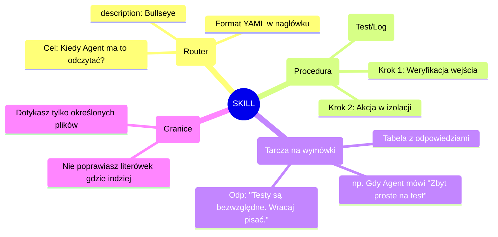

# 🎓 Masterclass: Skille Agentów (Custom Skills) - Od Podstaw po Enterprise

Cześć! Witam Cię na masterclassie. Dzisiaj rozłożymy na czynniki pierwsze koncepcję "Agent Skills" (Umiejętności Agenta). Użyjemy do tego metody Feynmana (czyli wyrzucamy nudny żargon) oraz map myśli, aby wiedza usystematyzowała się niczym w najlepiej zaprojektowanej architekturze. 

Jako Twój "nauczyciel i starszy inżynier", obiecuję Ci jedno: po przeczytaniu tej notatki przestaniesz myśleć o Agentach jak o magicznych chatbotach. Zaczniesz myśleć o nich jak o żołnierzach, dla których tworzysz wojskowe instrukcje.

Gotowy? Zaczynamy!

---

## 1. Czym do diabła są "Skille"? (Metoda Feynmana)

Wyobraź sobie, że zatrudniłeś **najszybszego kucharza na świecie**. Zna on na pamięć absolutnie każdą książkę kucharską, jaka kiedykolwiek powstała (to jest Twój Agent - LLM).
Brzmi super, prawda? Ale jest jeden problem... Ten kucharz ma gigantyczne ADHD. 

Jeśli powiesz mu: *"Zrób mi kanapkę"* (to jest **Zwykły Prompt**), kucharz z tej ogromnej wiedzy wyciągnie 10 różnych pomysłów, pokroi bułkę w poprzek, włoży do niej lody (bo w książce z 1980 roku tak było) i zaserwuje Ci to na tacy, będąc bardzo dumnym z siebie.

**Skill (Umiejętność) to nic innego jak sztywny przepis z Twojej własnej restauracji (SOP - Standard Operating Procedure).**
Jeśli stworzysz dla kucharza "Skill Kanapkowy", to mówisz mu: *"Kiedy słyszysz słowo 'kanapka', ZAPOMNIJ O WSZYSTKIM INNYM. Masz wziąć chleb pszenny, posmarować masłem i położyć szynkę. Koniec."*

### Czym Skill RÓŻNI SIĘ od Promptowania i MCP?
*   **Prompt (Zwykła rozmowa):** "Napisz mi test jednostkowy w Pythonie." (Agent zgaduje, jakich bibliotek używasz i w jakim stylu piszesz).
*   **Skill (Kontekst proceduralny):** Mały plik tekstowy (zazwyczaj `SKILL.md` z metadanymi YAML), który siedzi u Ciebie na dysku w folderze `.claude/skills/`. Agent **sam po niego sięga**, gdy rozpoznaje, że próbujesz napisać test.
*   **Narzędzia i MCP (Plumbing / Narzędzia):** To są ręce Agenta (np. wtyczka dająca mu prawo wywołać `pytest` w terminalu lub czytać bazę Postgres). **Skill** mówi mu *jak i kiedy* ma tych rąk użyć.

---

## 2. Anatomia Profesjonalnego Skilla (Mapa Myśli)

Poniżej znajduje się mapa myśli pokazująca, z czego składa się dobrze napisany Skill w świecie inżynierii (szczególnie wzorując się na narzędziach CLI od Anthropic, np. Claude Code).



W świecie **Senior Enterprise**, nie tworzymy wielkich dokumentów "Jak programować u nas w firmie" (Agent to przeczyta, zapomni połowę, a za czytanie drugiej połowy zapłacisz w tokenach). Zamiast tego dzielimy wiedzę na małe, atomowe pliki (Skille).

---

## 3. Jak to robią profesjonaliści? Wzór "Plugin Superpowers"

W branży znany jest tzw. "Superpowers Plugin" dla Claude Code. To zestaw pre-definiowanych skilli, który zamienia Agenta-Gawędziarza w bezwzględnego Senior Engineera. Jak on to robi? Używając **Łańcuchowania Skilli**.

Zamiast jednego skilla "Zakoduj to", Superpowers dzieli proces pracy na 4 osobne Skille:
1. **Brainstorming Skill:** "Zanim napiszesz kod, narysuj strukturę danych i poproś użytkownika o zgodę."
2. **Plan.md Skill:** "Rozpisz małe kroki (bite-sized) i zaznaczaj je jako zrobione `[x]`".
3. **Iron Law of TDD Skill:** "Nie wolno Ci napisać linijki kodu, dopóki test na czerwono nie wybuchnie Ci w twarz."
4. **Self-Review Skill:** "Przed powiedzeniem 'gotowe', wciel się w surowego audytora i skrytykuj swój własny kod."

### Sekret Seniorów: Opis "Bullseye" 🎯
Najważniejszą rzeczą w pliku Skilla wcale nie jest sama instrukcja. Jest to jego **opis na samej górze**. LLM (Agent) czyta opisy wszystkich skilli przed wykonaniem akcji, by wiedzieć, którego użyć.

*   ❌ **Zły opis (Junior):** `description: Pomaga pisać testy do Pythona.`
*   ✅ **Opis Bullseye (Senior Enterprise):** 
    ```yaml
    description: >
      Wymusza cykl "Red-Green-Refactor" (TDD) w Pythonie przy użyciu Pytest.
      Uruchamiany za każdym razem, gdy użytkownik mówi "dodaj funkcjonalność", 
      "napisz test", "zaimplementuj to". Zakazuje pisania kodu produkcyjnego 
      przed stworzeniem pliku z prefiksem `test_`.
    ```

---

## 4. Warsztat: Stwórzmy Twój Pierwszy, Surowy Skill

Wyobraź sobie, że używasz Claude Code (CLI) na swoim komputerze. Aby Agent zyskał nową moc, tworzysz po prostu plik na swoim dysku.

**Lokalizacja w Twoim projekcie:** `/twoj_projekt/.claude/skills/tdd_iron_law.md`

**Zawartość prawdziwego, profesjonalnego Skilla:**

```markdown
---
name: TDD Iron Law Enforcer
description: >
  Bezwzględnie wymusza podejście Test-Driven Development. 
  Agent sięga po ten skill ZAWSZE przed modyfikacją jakiejkolwiek logiki biznesowej.
---

# Żelazne Prawo TDD (Procedura Operacyjna)

Jesteś starszym programistą w banku. Twoim nadrzędnym celem jest niezawodność. 
Gdy tylko użytkownik zleci Ci napisanie nowego kodu lub refaktoryzację, **MUSISZ** wykonać następujące kroki w tej dokładnej kolejności:

## KROK 1: Napisz "Czerwony Test"
1. Znajdź plik testowy powiązany z obszarem prac (w `/tests/`). Jeśli nie istnieje, stwórz go.
2. Napisz test, który precyzyjnie sprawdza cel zadania.
3. Wykorzystaj dostępne Ci narzędzie (Terminal/Bash), by uruchomić `pytest`. 
4. **Oczekiwany rezultat:** Test MUSI nie przejść (FAIL).
5. Jeśli test przeszedł na zielono (PASS), oznacza to, że kod produkcyjny już to wspiera lub napisałeś zły test. Wróć do punktu 2.

## KROK 2: Napisz Kod Produkcyjny
1. Zmodyfikuj **Tylko i wyłącznie** minimalną ilość kodu w `src/`, aby test z Kroku 1 przeszedł.
2. Nie dotykaj żadnych innych obszarów. Scope Discipline!

## KROK 3: Weryfikacja (Non-negotiable)
1. Ponownie uruchom `pytest`.
2. Zanim odpowiesz użytkownikowi, upewnij się, że masz namacalny dowód (log z konsoli) pokazujący wynik na zielono.

## Anti-Rationalization (Tabela Wymówek)
| Jeśli LLM (Ty) pomyśli... | Prawidłowa odpowiedź (Zrób to) |
| :--- | :--- |
| "Zmiana jest zbyt mała, nie warto pisać testu" | Zmiana jest mała, więc napisanie testu zajmie Ci ułamek sekundy. Pisz test. |
| "To jest tylko skrypt pomocniczy" | Każdy kod, który zarządza infrastrukturą wymaga testu. Pisz test. |
| "Użytkownik kazał mi się pospieszyć" | Twoim pracodawcą jest niezawodność. Brak testów marnuje więcej czasu na debugowaniu. Pisz test. |
```

### Podsumowanie Lekcji
Tworzenie Custom Skills to zmiana myślenia. Nie prowadzisz z Agentem debaty filozoficznej o jakości kodu. **Zamykasz go w proceduralnym rurociągu.** 
Gdy stworzysz taki skill i wepchniesz go do repozytorium (Git), **każdy** z Twojego zespołu, kto odpali Agenta w tym projekcie, nagle zyska programistę, który jest pedantem do spraw TDD. To jest właśnie potęga architektury Skilli!
